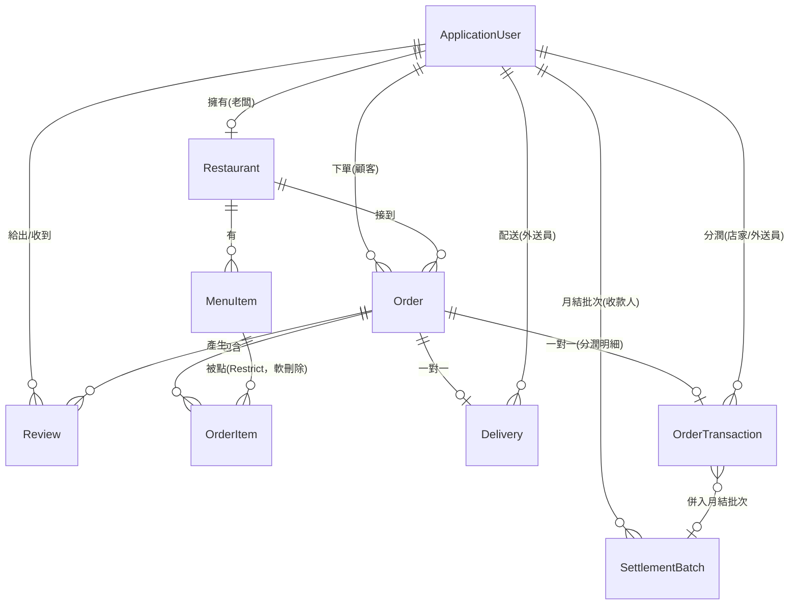

<div align="center">

# 🍱 YUYUEAT（Yustore）

**三方角色餐點外送平台** — 顧客點餐、店家備餐、外送員送達，完成後三方互評

ASP.NET Core 8 MVC · EF Core 8 · SQL Server · ASP.NET Core Identity

[](https://github.com/zo-ne/yuyu_eat/actions/workflows/ci.yml)

</div>

---

## 這是什麼

YUYUEAT 是一個以 ASP.NET Core 8 MVC 開發的餐點外送系統，涵蓋顧客點餐、店家管理、外送派送、三方互評與月結算的完整營運流程。三種角色（顧客／老闆／外送員）各自有獨立的權限與操作介面，訂單走一條八段狀態機（待付款 → 已付款 → 備餐中 → 待取餐 → 外送中 → 已送達 → 完成 / 已取消）。

> 📄 這個 repo 裡的 `docs/` 資料夾記錄了完整的專案分析過程：現況反推、業界落差評估、系統設計、以及接下來的目標規劃。想快速了解專案深度可以直接看那幾份文件。

## 技術棧

| 層 | 技術 |
|---|---|
| Runtime | .NET 8 |
| Web 框架 | ASP.NET Core MVC（Razor Views） |
| ORM | Entity Framework Core 8 + SQL Server Provider |
| 資料庫 | SQL Server（LocalDB / 容器皆可） |
| 認證授權 | ASP.NET Core Identity（Cookie 認證）+ 自訂角色 Filter |
| 郵件 | MailKit（Gmail SMTP） |
| 影像 | SixLabors.ImageSharp |
| 前端 | Bootstrap 5 + jQuery + jQuery Validation |
| 日誌 | Serilog（結構化日誌 + CorrelationId，寫 Console 與檔案） |
| 測試 | xUnit + FluentAssertions |
| CI | GitHub Actions（restore → build → test） |
| 容器化 | Docker + docker-compose（app + SQL Server 2022） |

## 功能總覽

- **顧客**：瀏覽店家、搜尋、查看菜單與評分、購物車、結帳、訂單追蹤、三方互評
- **老闆**：建立店家、菜單 CRUD、訂單管理與狀態更新
- **外送員**：可接訂單列表、搶單、送達拍照存證、我的訂單／收入
- **評價**：訂單完成後顧客／老闆／外送員三方互評（1~5 星 + 留言）
- **結算**：外送員送達時產生結算記錄（餐費歸老闆、外送費歸外送員）

三種角色的完整功能落差、已知問題與尚未實作的部分，見 [`docs/PRD.md`](docs/PRD.md)。

## 如何啟動

### 前置需求

- [.NET 8 SDK](https://dotnet.microsoft.com/download/dotnet/8.0)
- SQL Server（LocalDB 或任何 SQL Server 相容執行個體）
- （選用）Gmail 帳號 + 應用程式密碼，用來測試 Email 驗證信功能

### 1. 還原套件

```bash
dotnet restore
```

### 2. 設定機密（Email 密碼）

`appsettings.json` 裡刻意**不含**任何密鑰，本機開發請用 User Secrets：

```bash
cd Yustore
dotnet user-secrets set "EmailSettings:AppPassword" "你的 Gmail 應用程式密碼"
```

沒有要測試寄信功能的話可以先跳過這步，註冊流程會因為信寄不出去而卡在「請驗證信箱」，但資料庫操作與其他功能不受影響。

### 3. 建立資料庫

`appsettings.json` 預設連線字串指向 `(localdb)\mssqllocaldb`。若要用別的 SQL Server，改 `ConnectionStrings:DefaultConnection` 或用 User Secrets 覆寫。

```bash
dotnet tool install --global dotnet-ef   # 第一次需要安裝
dotnet ef database update --project Yustore
```

### 4. 執行

```bash
dotnet run --project Yustore
```

預設會在 `http://localhost:5247` 啟動（見 [`Yustore/Properties/launchSettings.json`](Yustore/Properties/launchSettings.json)）。

### 5. 開通老闆／外送師帳號（M4 起：走 Admin 審核後台）

註冊「老闆」或「外送師」身分後，帳號的 `ApplicationStatus` 預設是 `Pending`（V-08 修復：防止任何人自行註冊成店家/外送員），要等 Admin 審核通過才能使用相關功能。`IsActive` 現在是獨立的停權旗標，跟審核狀態脫鉤。

用預設種子帳號登入 Admin 後台審核（帳密走環境變數，見 [`.env.example`](.env.example) 的 `ADMIN_SEED_EMAIL`/`ADMIN_SEED_PASSWORD`；沒設定就用程式碼裡的預設值 `admin@yuyueat.local` / `ChangeMe123!`，**正式部署前務必改掉**），登入後在導覽列點「🛠️ 管理後台 → 📋 審核佇列」核准或退回申請。

顧客帳號不受影響，驗證 Email 後即可直接使用。

## 用 Docker 啟動（不想裝 SQL Server 的話）

不想在本機裝 SQL Server 的話，用 Docker Compose 一鍵把 app 跟資料庫都跑起來：

```bash
cp .env.example .env   # 改一下裡面的 DB_SA_PASSWORD
docker compose up --build
```

啟動後在 `http://localhost:8080` 開網站。第一次啟動時 app 會自動套用 EF Core migration 建好資料庫，不用手動下 `dotnet ef database update`。要清掉資料重來就 `docker compose down -v`（連同 volume 一起刪）。

## 跑測試

```bash
dotnet test Yustore.Tests
```

目前是單元測試（xUnit + FluentAssertions，共 85 個），優先覆蓋 [`docs/ASSESSMENT.md`](docs/ASSESSMENT.md) 點名的核心邏輯：購物車金額計算與使用者隔離、訂單狀態轉換白名單、評價授權判定、enum 顯示名稱、結算分潤金額計算、Admin 審核／停權／訂單篩選邏輯。不含整合測試（不需要跑資料庫），CI 用同一條指令跑，見 [`.github/workflows/ci.yml`](.github/workflows/ci.yml)。

## 資料模型



九張資料表：`ApplicationUser`（繼承 Identity，含 `Role`/`IsActive`/`ApplicationStatus`）、`Restaurant`、`MenuItem`、`Order`、`OrderItem`、`Delivery`、`OrderTransaction`、`SettlementBatch`、`Review`。金額欄位一律 `decimal(10,2)`。`OrderItem → MenuItem` 為 `Restrict`（刪餐點不會牽連歷史訂單），`MenuItem` 刪除採軟刪除（`IsDeleted`），`OrderItem` 額外保留 `MenuItemName` 名稱快照。

M4 把原本「寫了沒人讀」的 `Settlement` 單一資料表拆成兩張：`OrderTransaction` 是每筆訂單完成當下就寫入的分潤明細（餐費依 15% 平台抽成拆給店家、外送費全額歸外送員），`SettlementBatch` 是 Admin 手動觸發「產生本月結算批次」時，把某收款人（老闆或外送員）當月還沒結算的 `OrderTransaction` 加總成一筆，兩者是多對一（同一收款人/月份的批次唯一，見 unique 索引）。

## 專案文件

這個專案除了程式碼本身，還留了一套完整的分析與規劃文件：

| 文件 | 內容 |
|---|---|
| [`docs/PRD.md`](docs/PRD.md) | 反推現況：從程式碼推導出的實際產品規格 |
| [`docs/PRD-v2.md`](docs/PRD-v2.md) | 目標規劃：接下來要做成什麼樣子、里程碑與驗收標準 |
| [`docs/SDD.md`](docs/SDD.md) | 系統設計文件：架構、資料模型、認證授權設計 |
| [`docs/ASSESSMENT.md`](docs/ASSESSMENT.md) | 漏洞列表、與業界的落差、分階段改善方案 |
| [`docs/ROADMAP-外送平台.md`](docs/ROADMAP-外送平台.md) | 從「單店工具」到「外送平台」的改造路線圖 |

## 已知限制

目前處於 [`docs/PRD-v2.md`](docs/PRD-v2.md) 規劃的 **M0（止血）+ M1（安全與正確性）+ M2（工程實務）+ M3（架構重構）+ M4（治理與商業模式）** 之後的狀態：[`docs/ASSESSMENT.md`](docs/ASSESSMENT.md) 列出的全部 17 項安全/正確性漏洞（V-01 ~ V-17）都已修復，enum 全面改英文命名，補上單元測試（85 個）、CI、Docker、Serilog、`.editorconfig`；五個業務網域（訂單/店家/結算/評價/治理）都已抽成 Service 層（`IOrderService`/`IRestaurantService`/`ISettlementService`/`IReviewService`/`IAdminService`），Controller 只剩接資料、呼叫 Service、回應；角色改用 Claims（`_Layout` 不再查 DB），寄信改背景佇列，四個原本零分頁的列表頁加上分頁；老闆／外送師改走申請制（`ApplicationStatus`），新增 Admin 治理後台（審核佇列、停權管理、全平台訂單總覽、結算批次管理），結算邏輯拆成 `OrderTransaction`（單筆分潤）+ `SettlementBatch`（月結批次），15% 平台抽成商業模式正式落地。下列項目仍在後續里程碑中：

- 金流為模擬付款，尚未串接真實金流（M5）
- 尚無即時通知（SignalR），訂單狀態更新仍需手動整頁重新整理（M5）
- DTO 投影（`.Select()` 取代 `.Include()`）只套用在有加分頁的查詢，沒有全站通盤重構（M3 後續）
- 只有單元測試，沒有整合測試；沒有設覆蓋率門檻
- Session 用記憶體、上傳檔案存本機磁碟，尚未支援水平擴展

完整清單見 [`docs/ASSESSMENT.md`](docs/ASSESSMENT.md)。
