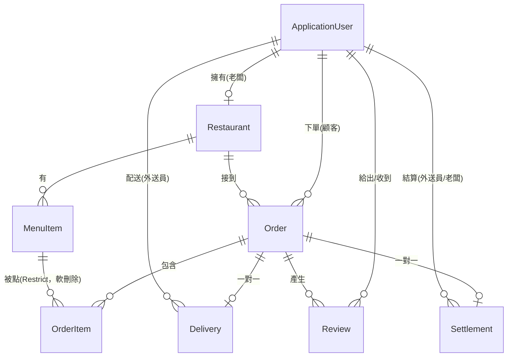

<div align="center">

# 🍱 YUYUEAT（Yustore）

**三方角色餐點外送平台** — 顧客點餐、店家備餐、外送員送達，完成後三方互評

ASP.NET Core 8 MVC · EF Core 8 · SQL Server · ASP.NET Core Identity

</div>

---

## 這是什麼

YUYUEAT 是一個以 ASP.NET Core 8 MVC 開發的餐點外送系統，涵蓋顧客點餐、店家管理、外送派送、三方互評與月結算的完整營運流程。三種角色（顧客／老闆／外送員）各自有獨立的權限與操作介面，訂單走一條八段狀態機（待付款 → 已付款 → 備餐中 → 待取餐 → 外送中 → 已送達 → 完成 / 已取消）。

> 📄 這個 repo 裡的 `docs/` 資料夾記錄了完整的專案分析過程：現況反推、業界落差評估、系統設計、以及接下來的目標規劃。想快速了解專案深度可以直接看那幾份文件。

## 技術棧

| 層 | 技術 |
|---|---|
| Runtime | .NET 8 |
| Web 框架 | ASP.NET Core MVC（Razor Views） |
| ORM | Entity Framework Core 8 + SQL Server Provider |
| 資料庫 | SQL Server（LocalDB / 容器皆可） |
| 認證授權 | ASP.NET Core Identity（Cookie 認證）+ 自訂角色 Filter |
| 郵件 | MailKit（Gmail SMTP） |
| 影像 | SixLabors.ImageSharp |
| 前端 | Bootstrap 5 + jQuery + jQuery Validation |

## 功能總覽

- **顧客**：瀏覽店家、搜尋、查看菜單與評分、購物車、結帳、訂單追蹤、三方互評
- **老闆**：建立店家、菜單 CRUD、訂單管理與狀態更新
- **外送員**：可接訂單列表、搶單、送達拍照存證、我的訂單／收入
- **評價**：訂單完成後顧客／老闆／外送員三方互評（1~5 星 + 留言）
- **結算**：外送員送達時產生結算記錄（餐費歸老闆、外送費歸外送員）

三種角色的完整功能落差、已知問題與尚未實作的部分，見 [`docs/PRD.md`](docs/PRD.md)。

## 如何啟動

### 前置需求

- [.NET 8 SDK](https://dotnet.microsoft.com/download/dotnet/8.0)
- SQL Server（LocalDB 或任何 SQL Server 相容執行個體）
- （選用）Gmail 帳號 + 應用程式密碼，用來測試 Email 驗證信功能

### 1. 還原套件

```bash
dotnet restore
```

### 2. 設定機密（Email 密碼）

`appsettings.json` 裡刻意**不含**任何密鑰，本機開發請用 User Secrets：

```bash
cd Yustore
dotnet user-secrets set "EmailSettings:AppPassword" "你的 Gmail 應用程式密碼"
```

沒有要測試寄信功能的話可以先跳過這步，註冊流程會因為信寄不出去而卡在「請驗證信箱」，但資料庫操作與其他功能不受影響。

### 3. 建立資料庫

`appsettings.json` 預設連線字串指向 `(localdb)\mssqllocaldb`。若要用別的 SQL Server，改 `ConnectionStrings:DefaultConnection` 或用 User Secrets 覆寫。

```bash
dotnet tool install --global dotnet-ef   # 第一次需要安裝
dotnet ef database update --project Yustore
```

### 4. 執行

```bash
dotnet run --project Yustore
```

預設會在 `http://localhost:5247` 啟動（見 [`Yustore/Properties/launchSettings.json`](Yustore/Properties/launchSettings.json)）。

## 資料模型



八張資料表：`ApplicationUser`（繼承 Identity）、`Restaurant`、`MenuItem`、`Order`、`OrderItem`、`Delivery`、`Settlement`、`Review`。金額欄位一律 `decimal(10,2)`。`OrderItem → MenuItem` 為 `Restrict`（刪餐點不會牽連歷史訂單），`MenuItem` 刪除採軟刪除（`IsDeleted`），`OrderItem` 額外保留 `MenuItemName` 名稱快照。

## 專案文件

這個專案除了程式碼本身，還留了一套完整的分析與規劃文件：

| 文件 | 內容 |
|---|---|
| [`docs/PRD.md`](docs/PRD.md) | 反推現況：從程式碼推導出的實際產品規格 |
| [`docs/PRD-v2.md`](docs/PRD-v2.md) | 目標規劃：接下來要做成什麼樣子、里程碑與驗收標準 |
| [`docs/SDD.md`](docs/SDD.md) | 系統設計文件：架構、資料模型、認證授權設計 |
| [`docs/ASSESSMENT.md`](docs/ASSESSMENT.md) | 漏洞列表、與業界的落差、分階段改善方案 |
| [`docs/ROADMAP-外送平台.md`](docs/ROADMAP-外送平台.md) | 從「單店工具」到「外送平台」的改造路線圖 |

## 已知限制

目前處於 [`docs/PRD-v2.md`](docs/PRD-v2.md) 規劃的 M0（止血）階段完成後的狀態：核心安全漏洞（越權評分、級聯刪除歷史資料、購物車數量未驗證）已修復，但下列項目仍在後續里程碑中：

- 金流為模擬付款，尚未串接真實金流
- 尚無 Admin 治理後台
- 訂單狀態可被老闆任意跳轉，尚無狀態機約束（M1 處理）
- 尚無自動化測試與 CI（M2 處理）
- Session 用記憶體、上傳檔案存本機磁碟，尚未支援水平擴展

完整清單見 [`docs/ASSESSMENT.md`](docs/ASSESSMENT.md)。
