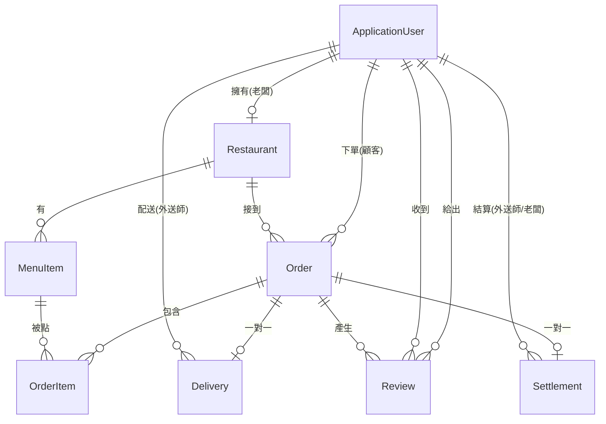

# YUYUEAT Yustore — 系統設計文件(SDD)

> 反推自程式碼的實際架構文件。撰寫日期:2026-08-07 ・ commit `129b990`

---

## 1. 技術棧

| 層 | 技術 | 版本 |
|---|---|---|
| Runtime | .NET | 8.0 |
| Web 框架 | ASP.NET Core MVC(Razor Views,伺服器端渲染) | 8.0 |
| ORM | Entity Framework Core + SQL Server Provider | 8.0.11 |
| 資料庫 | SQL Server LocalDB | — |
| 認證授權 | ASP.NET Core Identity(`IdentityDbContext<ApplicationUser>`) | 8.0.11 |
| 郵件 | MailKit(Gmail SMTP / StartTLS) | 4.3.0 |
| 影像 | SixLabors.ImageSharp | 3.1.7 ⚠️ **已引用但完全未使用** |
| 前端 | Bootstrap 5 + jQuery + jQuery Validation(靜態檔) | — |
| 狀態 | ASP.NET Core Session(`AddDistributedMemoryCache`,30 分逾時) | — |

**方案結構**

```
Yustore.sln
├── Yustore/         ← 實際專案
└── AYuCantina/      ← 空的 scaffold,無任何自訂程式碼(死專案)
```

---

## 2. 分層架構

```
┌──────────────────────────────────────────────────────┐
│  Views/ (Razor)   _Layout 依角色渲染導覽列            │
├──────────────────────────────────────────────────────┤
│  Controllers/     Account│Customer│Owner│Driver│Review│
│  Filters/         CustomerOnly│OwnerOnly│DriverOnly   │
├──────────────────────────────────────────────────────┤
│  Services/        ICartService │ IEmailService        │
│                   IImageService                       │
├──────────────────────────────────────────────────────┤
│  Data/AppDbContext (EF Core)  ← Controller 直接注入   │
├──────────────────────────────────────────────────────┤
│  SQL Server LocalDB │ wwwroot/uploads(檔案系統)      │
└──────────────────────────────────────────────────────┘
```

**關鍵設計決策**:**沒有 Repository / Service 層隔離資料存取**。Controller 直接持有 `AppDbContext` 並寫 LINQ 查詢。業務邏輯(訂單建立、結算產生、狀態轉換)全部散落在 Controller 的 Action 裡。

這是「教學專案 / 小型 MVC」的標準寫法,但也是**與業界專案最大的結構落差之一**(詳見 ASSESSMENT.md §3)。

---

## 3. 資料模型

### 3.1 ER 圖



### 3.2 實體摘要

| 實體 | PK | 關鍵欄位 | 備註 |
|---|---|---|---|
| `ApplicationUser` | `string` (Identity) | `FullName`, `Role`, `AvatarUrl`, `IsActive`, `CreatedAt` | 繼承 `IdentityUser`;`IsActive` 從未被讀取 |
| `Restaurant` | `int` | `Name`, `Address`, `Phone`, `LogoUrl`, `IsOpen`, `OwnerId` | 一位老闆一家店(應用層限制,DB 無 unique 約束) |
| `MenuItem` | `int` | `Name`, `Price decimal(10,2)`, `ImageUrl`, `IsAvailable` | 無分類、無選項、無庫存 |
| `Order` | `int` | `OrderNumber`, `Status`, `FoodTotal`, `DeliveryFee`, `GrandTotal`, `DeliveryAddress` | `OrderNumber` **無 unique 索引** |
| `OrderItem` | `int` | `Quantity`, `UnitPrice`(價格快照), `Subtotal` | ⚠️ FK→MenuItem 是 **Cascade** |
| `Delivery` | `int` | `PickedUpAt`, `DeliveredAt`, `ProofPhotoUrl` | 與 Order 一對一(有 unique 索引) |
| `Settlement` | `int` | `Year`, `Month`, `FoodAmount`, `Status` | 一訂單一列,但欄位是月結語意 |
| `Review` | `int` | `Stars`, `Comment`, `TargetType` | 無 `(OrderId, ReviewerId, TargetUserId)` unique 約束 |

### 3.3 刪除行為(`AppDbContext.OnModelCreating`)

明確設為 `Restrict` 的關聯(為了避開 SQL Server 多重刪除路徑錯誤):

- `Review → Reviewer / TargetUser`
- `Settlement → Driver / Owner / Order`
- `Order → Customer / Restaurant`
- `Delivery → Driver / Order`

**未設定、因此沿用 EF 預設 `Cascade` 的關聯:**

- `MenuItem → Restaurant`(Cascade)
- **`OrderItem → MenuItem`(Cascade)** ← 見 ASSESSMENT.md V-02,這會造成歷史資料遺失
- `OrderItem → Order`(Cascade)

### 3.4 Decimal 精度

`MenuItem.Price`、`Order.FoodTotal/DeliveryFee/GrandTotal`、`OrderItem.UnitPrice/Subtotal`、`Settlement.FoodAmount` 全部明確設為 `decimal(10,2)`。這點做得正確。

---

## 4. 認證與授權設計

### 4.1 認證

```csharp
// Program.cs
AddIdentity<ApplicationUser, IdentityRole>(options => {
    options.SignIn.RequireConfirmedEmail = true;
    options.Password.RequiredLength = 8;
    options.Password.RequireDigit = true;
    options.Password.RequireUppercase = false;
    options.Password.RequireNonAlphanumeric = false;
})
```

Cookie 認證(Identity 預設)。Email 驗證 token 由 `AddDefaultTokenProviders()` 提供。

### 4.2 授權(這是本專案最特殊的設計)

**全域預設拒絕**:

```csharp
options.Filters.Add(new AuthorizeFilter(
    new AuthorizationPolicyBuilder().RequireAuthenticatedUser().Build()));
```

所有 Controller 預設需登入,`AccountController` 與 `HomeController` 用 `[AllowAnonymous]` 開放。**這個設計是對的**(fail-closed)。

**角色檢查**:自訂三個 `ActionFilterAttribute`:

```csharp
public class OwnerOnlyAttribute : ActionFilterAttribute
{
    public override async Task OnActionExecutionAsync(...)
    {
        var userManager = context.HttpContext.RequestServices
            .GetRequiredService<UserManager<ApplicationUser>>();
        var user = await userManager.GetUserAsync(context.HttpContext.User);
        if (user == null || user.Role != UserRole.老闆) {
            context.Result = new RedirectToActionResult("Index", "Home", null);
            return;
        }
        await next();
    }
}
```

**問題點**(三個 Filter 是複製貼上的同一份程式碼):

1. **沒有使用 Identity 內建的 Role 系統** — `IdentityRole` 有註冊但 `AspNetRoles` 表永遠是空的。角色存在 `ApplicationUser.Role` 這個自訂欄位,無法用 `[Authorize(Roles = "Owner")]`,也無法用 Claims 做無狀態授權。
2. **每個受保護請求都多打一次 DB** — `GetUserAsync()` 每次 request 查一次 `AspNetUsers`。`_Layout.cshtml` 還會**再查一次**。一個頁面至少 2 次多餘查詢。
3. **回傳 302 Redirect 而不是 403 Forbid** — 語意錯誤,也讓 API 化困難。
4. **沒有檢查 `IsActive`** — 停權欄位形同虛設。
5. **三份重複程式碼** — 應該是一個 `[RoleRequired(UserRole.老闆)]` 帶參數的 Filter。

---

## 5. 購物車設計

`CartService` 把整個購物車序列化成 JSON 存進 Session:

```
Session["ShoppingCart"] = JsonSerializer.Serialize(CartViewModel)
```

`CartViewModel` 包含 `RestaurantId`、`RestaurantName`、`List<CartItemViewModel>`,每個 item 帶著 `MenuItemId / Name / Price / Quantity / ImageUrl`。

**設計後果**:

- ✅ 價格存在伺服器 Session,**客戶端無法直接竄改價格**(這點常被誤判為漏洞,實際上是安全的)
- ⚠️ Session 用 `AddDistributedMemoryCache()`(記憶體) → **重啟即失效、無法水平擴展**
- ⚠️ **購物車不綁使用者** — `SignOutAsync()` 不會清 Session,同一瀏覽器換人登入會看到前一位的購物車
- ⚠️ 結帳時**不重新查資料庫**驗證餐點是否仍存在/仍供應/價格是否已變 → 用的是加入購物車當下的舊價格

---

## 6. 檔案上傳設計

```csharp
// ImageService.SaveImageAsync
var uploadPath = Path.Combine(_env.WebRootPath, "uploads", folder);
var fileName = $"{Guid.NewGuid()}{Path.GetExtension(file.FileName)}";  // 保留使用者的副檔名
await file.CopyToAsync(new FileStream(filePath, FileMode.Create));
return $"/uploads/{folder}/{fileName}";
```

- 檔名用 GUID(✅ 避免覆蓋與路徑穿越)
- **副檔名直接取自使用者上傳的檔名**(❌)
- **無 MIME 檢查、無 magic byte 檢查、無檔案大小上限、無圖片重新編碼**
- 存進 `wwwroot/` → 由 `UseStaticFiles()` 直接對外提供

證據:`wwwroot/uploads/menu/230d0113-….HEIC` — 一個瀏覽器根本無法顯示的 HEIC 檔已經成功上傳並存在版控裡。

`DeleteImage` 用 `Path.Combine(_env.WebRootPath, imageUrl.TrimStart('/'))`,無路徑正規化檢查(目前 `imageUrl` 都是系統產生所以不可利用,但是危險模式)。

---

## 7. Email 設計

`EmailService` 每次寄信都**新建一條 SMTP 連線**,同步 `await`,沒有重試、沒有佇列。

觸發點只有兩個:
1. 註冊驗證信
2. 老闆把訂單改成「待取餐」時 → **在 `foreach` 迴圈裡同步寄給所有外送師**

```csharp
foreach (var driver in drivers)
    await _emailService.SendEmailAsync(driver.Email!, ...);   // N 條 SMTP 連線,阻塞 HTTP 請求
await _db.SaveChangesAsync();   // ← 寄信失敗的話,狀態根本不會被儲存
```

信件內容用字串內插直接組 HTML,**未做 HTML 編碼**,且連結硬編 `https://localhost:7001`。

---

## 8. 設定與機密

```json
// Yustore/appsettings.json —— 這個檔案「在版控裡」
{
  "ConnectionStrings": { "DefaultConnection": "Server=(localdb)\\mssqllocaldb;..." },
  "EmailSettings": { "SenderEmail": "…@gmail.com", "AppPassword": "" }
}
```

`.csproj` 有 `<UserSecretsId>`,代表開發時 App Password 走 User Secrets(✅ 正確做法),但**設定檔的結構本身鼓勵把密碼填進去**,且 `.gitignore` 完全沒有 `appsettings*.json` 的規則。目前 git 歷史中 `AppPassword` 一直是空字串,**尚未外洩**。

---

## 9. 部署現況

- ❌ 無 `Dockerfile` / `docker-compose.yml`
- ❌ `.github/workflows/` 是**空資料夾**
- ❌ 無 README、無環境設定說明
- ❌ 連線字串綁死 Windows LocalDB
- ❌ Session 用記憶體 → 無法多執行個體部署
- ❌ 上傳檔案存本機磁碟 → 無法多執行個體部署
- ⚠️ `wwwroot/uploads/` 底下 6 個實際上傳的檔案(含 3 張外送送達證明照)**被 commit 進版控**

---

## 相關文件

- [PRD.md](./PRD.md) — 產品需求文件（反推現況）
- [PRD-v2.md](./PRD-v2.md) — 目標產品需求文件（含時間表與驗收標準）
- [ASSESSMENT.md](./ASSESSMENT.md) — 漏洞、業界落差與改善方案
- [ROADMAP-外送平台.md](./ROADMAP-外送平台.md) — 平台化路線圖
